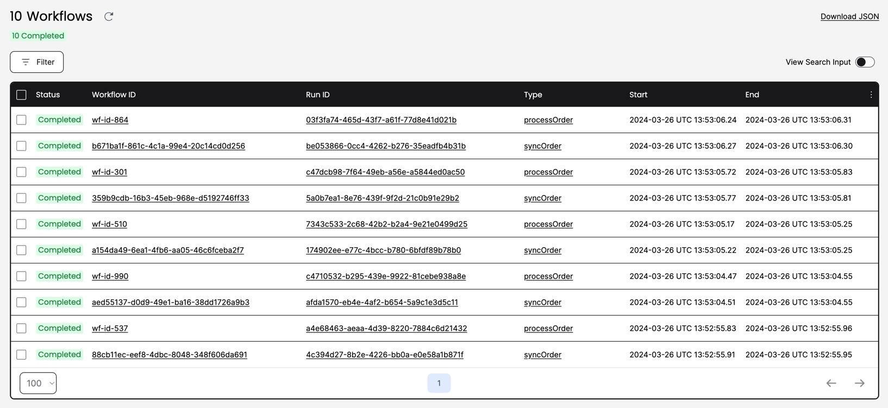
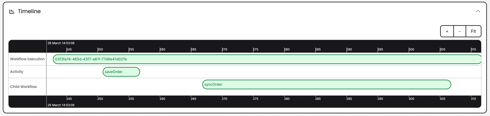
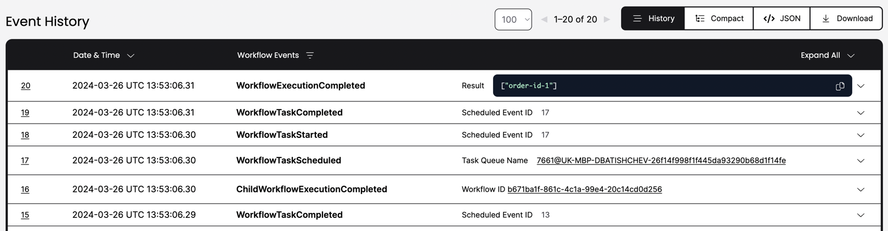
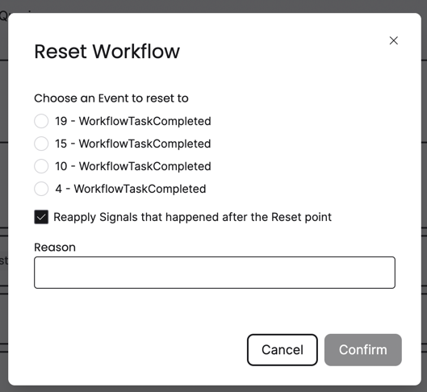

## Installation

```shell
brew install temporal
temporal server start-dev
yarn install
yarn start:dev
```

The Temporal Server will be available on localhost:7233.
The Temporal Web UI will be available at http://localhost:8233.

To run the tests:
```shell
yarn test:e2e --forceExit
```

## Implementation

I used [nestjs-temporal](https://github.com/KurtzL/nestjs-temporal) library to integrate Temporal with NestJS.

I created a simple workflow to show how the usage of Temporal in existing NestJS applications might look like. The workflow is defined in `src/workflows.ts` and represents a simple process of saving an entity to the database. 

Usually, when we do such operations we also need to do some additional tasks like sending domain events, sync data with other services, etc.
Due to the nature of distributed systems it might be quite hard to handle these operations in a reliable way. Temporal helps use to solve this problem by taking care everything related to the error handling, retries, timeouts, etc.

In the workflow, we have 3 activities: `saveOrder`, `sendOrderCreatedDomainEvent` and `syncEvent`. Each of them is a separate function that is executed by the Temporal worker. In case of any error, Temporal will retry the activity until it succeeds or the maximum number of retries is reached. It's possible to tune the number of retries, timeouts, etc. in the activity configuration:
```typescript
const { sendAnalyticsSyncEvent } = proxyActivities<ISendSyncEventActivity>({
  startToCloseTimeout: '1 minute',
});
```

Basically, usage of a workflow engine makes the code simpler and more reliable since we don't need to configure queues, retries, timeouts, idempotency of event handling, etc. Temporal takes care of all these things.

Also I tried to show that the migration to any Workflow Engine is quite simple and doesn't require a lot of changes in the existing codebase. We just need to extract the business logic steps to the activities and define the workflow, so the code can be migrated gradually without blocking the development process.

## Tests

Temporal provides an in-memory implementation (similar to what MongoDB does) that can be used for testing purposes. Since it can be easily integrated to the testing environment, we can write tests as before (using the tools that NestJS provides) without any need to change the codebase. We can override services in the DI container as usual and mock the dependencies.

## Temporal Web UI

If we send some requests to the server and open the Temporal Web UI, we can see the workflow executions and the history of each execution:



If we click on the workflow ID, we can see the timeline of the workflow:



and the history of each activity:



which might be very useful for debugging and investigating issues.

Also, it's possible to restart the execution from any point in the history:

